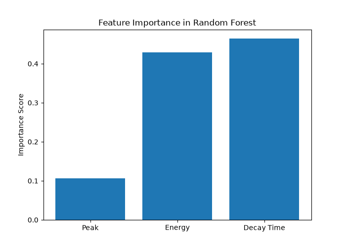
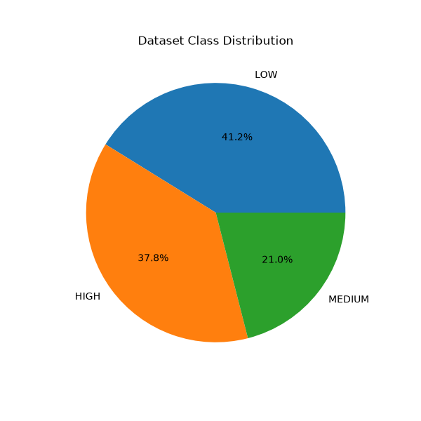
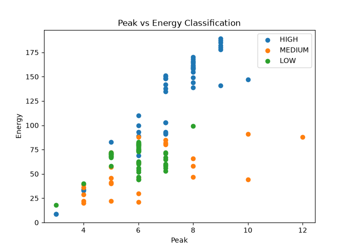
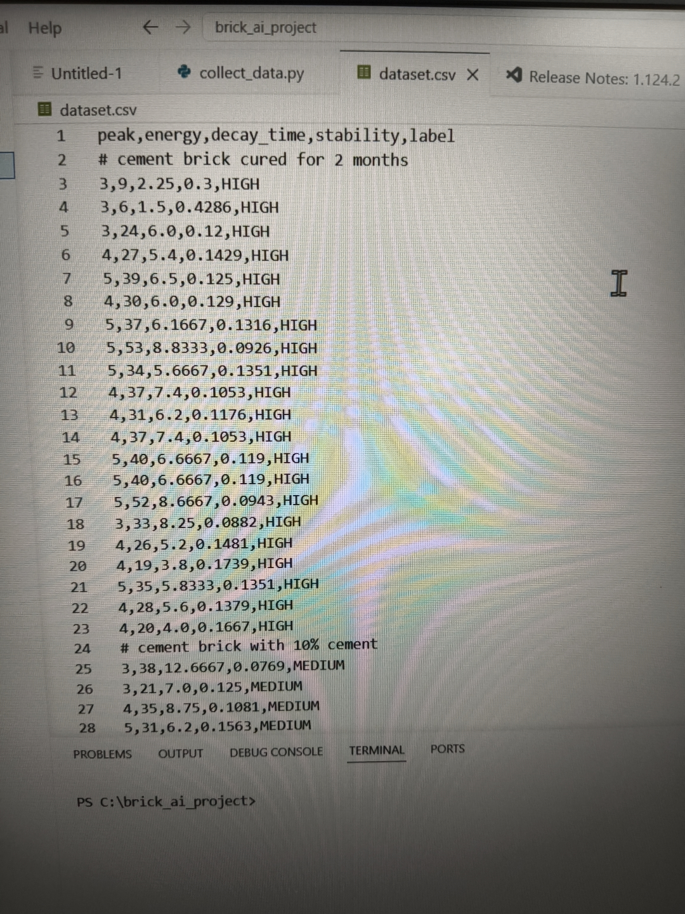
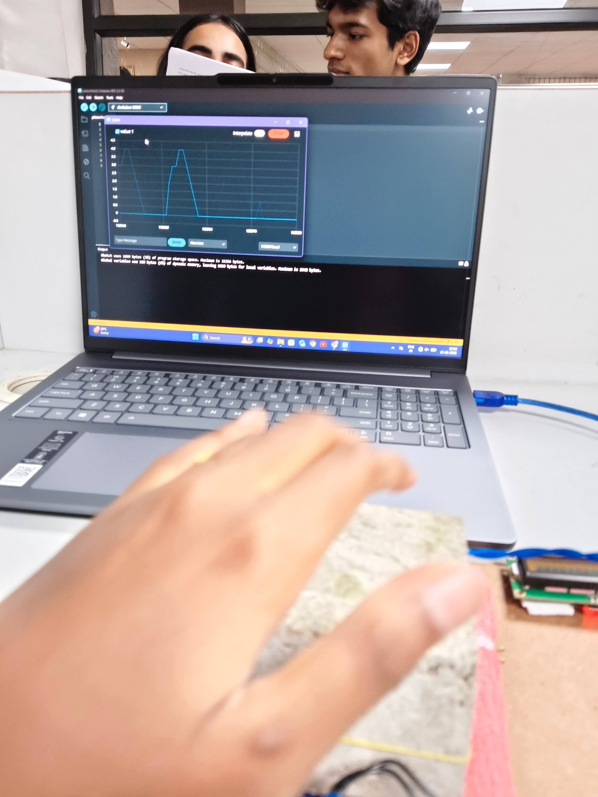
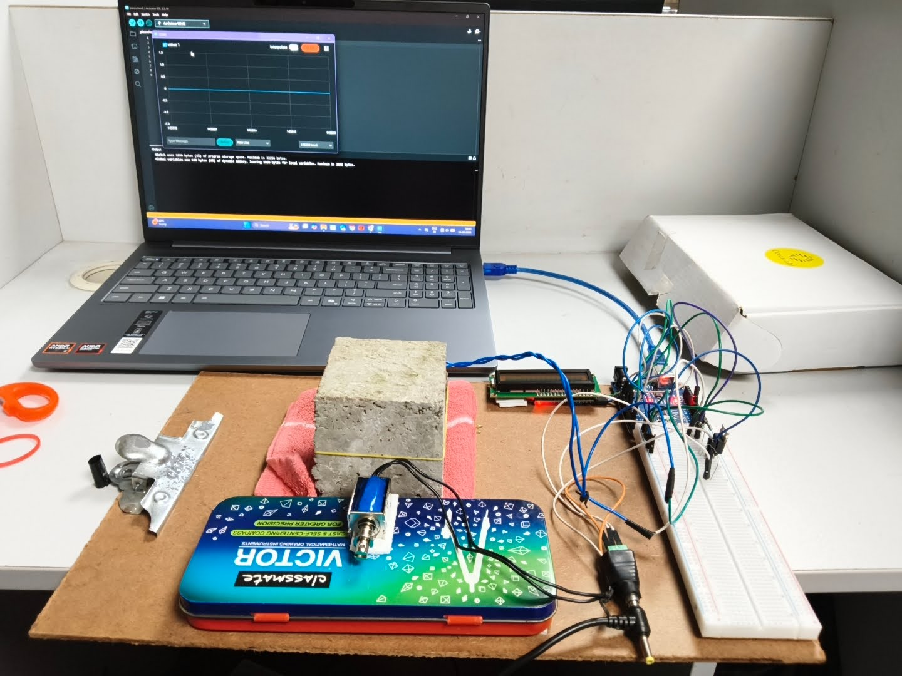

## Project Images and Results

### 1. Feature Importance Analysis
The figure below shows the feature importance scores generated by the trained Random Forest model. The model evaluates the contribution of the three extracted acoustic features—Peak, Energy, and Decay Time—to the brick classification process.

### 2. Dataset Class Distribution
This pie chart illustrates the distribution of samples across the different brick classes present in the dataset used for training and testing.

### 3. Peak vs Energy Classification
The scatter plot visualizes the relationship between Peak and Energy values for different brick categories. Distinct clustering of classes indicates that the extracted acoustic features are useful for classification.

### 4. Dataset Sample
A snapshot of the dataset used for model training. The dataset contains extracted acoustic features (Peak, Energy, and Decay Time) along with the corresponding brick labels.

### 5. Piezo Sensor Signal Detection
Serial Monitor output showing a clear voltage spike when a brick is tapped. This demonstrates that the piezoelectric sensor successfully captures impact vibrations with minimal environmental noise, enabling reliable feature extraction.

### 6. Experimental Setup
Complete hardware setup used for data collection and testing, including the piezoelectric sensor, Arduino, impact mechanism, and supporting components.

